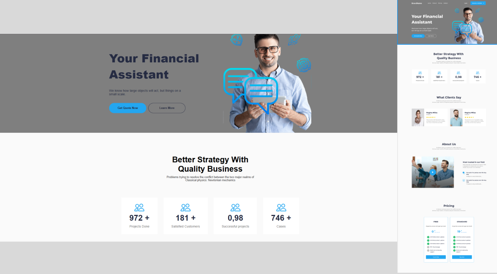

# 🚀✅ Finance - Concluído ✅🚀

• [Sobre o Projeto](#-sobre-o-projeto) \
• [Layout](#-layout) \
• [Como executar](#-como-executar-o-projeto) \
• [Tecnologias](#-tecnologias) \
• [Autor](#-autor) \
• [Arquitetura de Pastas](#-arquitetura-de-pastas) \
• [Licença](#-licença)

---

## 💻 Sobre o projeto

Este é um projeto colaborativo desenvolvido por 4 integrantes, onde cada um ficou responsável por uma parte específica de uma landing page. O foco principal do projeto é a construção do layout utilizando apenas HTML e CSS, seguindo fielmente o design proposto no Figma.

---

## 🎨 Layout



---

## 🚀 Como executar o projeto

1 - Baixar o Projeto \
2 - Abrir em um editor de código \
3 - Abrir o arquivo index.html

## Pré-requisitos

Antes de começar, você vai precisar ter instalado em sua máquina o seguinte editor de código:
[VSCode](https://code.visualstudio.com/)

---

## 🛠 Tecnologias

As seguintes ferramentas foram usadas na construção do projeto:

### **Desenvolvimento** [HTML](https://developer.mozilla.org/en-US/docs/Web/HTML), [CSS](https://developer.mozilla.org/en-US/docs/Web/CSS), [GIT](https://git-scm.com/doc)

### **Prototipação** ([Figma](https://www.figma.com/))

- **[Protótipo utilizado](https://www.figma.com/design/FV5Plfkn4pzoNwq853BgQI/Financen---html-finance-web-page?node-id=1479-801&p=f&t=HgKnodODgkunQ1x3-0)**

---

## 💪 Como contribuir para o projeto

1. Faça um **fork** do projeto.
2. Crie uma nova branch com as suas alterações: `git checkout -b my-feature`
3. Salve as alterações e crie uma mensagem de commit contando o que você fez: `git commit -m "feature: My new feature"`
4. Envie as suas alterações: `git push origin my-feature`
   > Caso tenha alguma dúvida confira este [guia de como contribuir no GitHub](./CONTRIBUTING.md)

---

## 📂 Arquitetura de Pastas

```md
┣ 📄 index.html
┣ 📄 README.md
┣ 📂src
┣ ┣📂 styles
┃ ┣ footer.css
┃ ┣ global.css
┃ ┣ header.css
┃ ┣ main.css
┃ ┣ section-about-us.css
┃ ┣ section-hero.css
┃ ┣ section-pricing.css
┃ ┣ section-say-clients.css
┃ ┗ styles.css
┣ 📂 page
┃ ┣ footer.html
┃ ┣ header.html
┃ ┣ main.html
┃ ┣ section-about-us.html
┃ ┣ section-hero.html
┃ ┣ section-pricing.html
┃ ┗ section-say-clients.html
┗ 📂 assets
┃ ┣ 📂image
┃ ┃ ┣ card-item-about-us.svg
┃ ┃ ┣ circulo-cinza.svg
┃ ┃ ┣ circulo-verde.svg
┃ ┃ ┣ clients-icon.svg
┃ ┃ ┣ empty-star.svg
┃ ┃ ┣ full-star.svg
┃ ┃ ┣ icn settings .icn-md-2.svg
┃ ┃ ┣ icn settings .icn-md.svg
┃ ┃ ┣ main.svg
┃ ┃ ┣ mapa.svg
┃ ┃ ┣ persona-girl.svg
┃ ┃ ┣ persona-man.svg
┃ ┃ ┗ resumo-projeto-finance.png
```

---

## 🦸 Autor

Feito por Jonathan Almeida👋🏽 [Entre em contato!](https://www.linkedin.com/in/JonathanASf/)

Feito por Wiglefer Lopes👋🏽 [Entre em contato!](https://www.linkedin.com/in/wigleferlopes/)

Feito por Gustavo Freitas Dias👋🏽 [Entre em contato!](https://www.linkedin.com/in/gustavo-freitas-83a3a5366/)

Feito por Wesley Matheus[Entre em contato!](https://www.linkedin.com/in/wesley-matheus-101339355/)

---

## 📝 Licença

Este projeto esta sobe a licença [MIT](https://opensource.org/license/mit).
